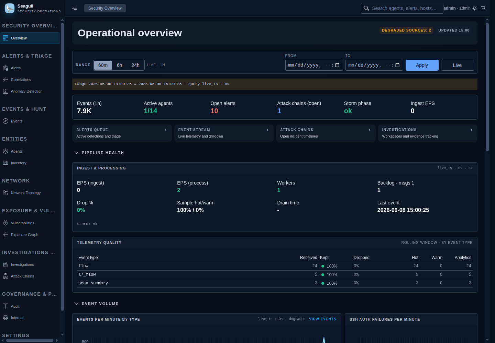

# Seagull


Seagull is an open security operations platform for collecting endpoint and
network telemetry, detecting suspicious behavior, and giving analysts a focused
SOC portal for investigation.

It combines a Go endpoint/network agent, a FastAPI control plane, detection and
enrichment workers, PostgreSQL/ClickHouse/Elasticsearch storage, and a React
portal built for alert triage, hunting, topology, exposure, vulnerabilities,
audit, and operational observability.



## What Seagull Provides

| Area | What matters |
|---|---|
| Telemetry collection | Go agents collect process/network flows, SSH auth logs, PCAP-based scan/DDoS/L7 signals, syscollector inventory, and vulnerability context. |
| Detection engineering | YAML rule packs, correlation incidents, attack-chain stories, Sigma import support, backtesting, and rule health/governance. |
| Analyst portal | Overview, alerts, event hunting, SSH insights, protocol intelligence, agents, inventory, vulnerabilities, exposure graph, network topology, investigations, UEBA, audit, and settings. |
| Agent control plane | Bootstrap enrollment, rotating credentials, heartbeats, remote config, response-action staging, and optional native `systemd` deployment. |
| Data pipeline | Fast ingest API, Redis backpressure queue, PostgreSQL operational store, ClickHouse analytics sink, Elasticsearch hunting index, and worker groups for ingest/intelligence/maintenance. |
| Security operations | RBAC, HttpOnly refresh cookies, admin audit events, login audit trail, hardened headers, rate limiting, and production-oriented secret handling through `*_FILE` variables. |
| Observability | Health endpoints, Prometheus-format metrics, internal Prometheus scraping, and authenticated observability APIs in the portal. |

## Architecture

```text
Go agents
  proc / authlog / pcap / syscollector / vuln
        |
        | HTTPS agent API
        v
Caddy edge  --->  FastAPI backend  ---> PostgreSQL
        |              |   |             ClickHouse
        |              |   |             Elasticsearch
        |              |   |
        |              |   +-- Redis ingest queue / rate limit
        |              |
        |              +-- ingest / intelligence / maintenance workers
        |
        +-- React portal
```

Core services are declared in [`compose.yml`](compose.yml):

| Service | Role |
|---|---|
| `seagull-portal` | React/Vite single-page portal served by nginx. |
| `seagull-backend` | FastAPI API for ingest, auth, agents, detections, triage, inventory, topology, exposure, and admin operations. |
| `seagull-ingest-pipeline` | Queue draining, indexing, rollups, ClickHouse/Elasticsearch sink work. |
| `seagull-intelligence-worker` | Rules, correlations, protocol intelligence, IP enrichment, attack chains, exposure, topology, and UEBA. |
| `seagull-maintenance-worker` | Audit retention and recurring maintenance tasks. |
| `postgres`, `redis`, `clickhouse`, `elasticsearch`, `prometheus` | Runtime data and observability infrastructure. |
| `caddy` | HTTPS edge for portal, API, and the dedicated agent mTLS listener. |

Agents are not containers: they run as a native `systemd` service
(`seagull-agent`) on each monitored host and reach the platform through the
mTLS listener on port 8444.

## Quickstart

### Requirements

- Linux host with `systemd` (required for the agent and PCAP collectors).
- Docker with the Compose plugin.
- Git, curl, jq.
- Python 3 with the `cryptography` package (internal PKI generation).
- Go >= 1.21, gcc, and libpcap headers (the host agent is built from source).

On a new machine, install everything in one step:

```bash
./seagull -d --install
```

`./seagull -d` (or `./seagull deps`) reports the status of each host
dependency; `--install` runs [`deploy/install-deps.sh`](deploy/install-deps.sh)
via sudo (Debian/Ubuntu fully supported, Fedora/RHEL best-effort). If Docker was
just installed, log out and back in (or run `newgrp docker`) so your user picks
up the `docker` group.

- Node is only required for frontend development outside Docker.

### Start the Stack

Before the first startup, create a free MaxMind account, generate a license key,
and set `MAXMIND_LICENSE_KEY` in `.env`.

```bash
git clone https://gitlab.com/nathanmblima/seagull.git
cd seagull
./seagull -d --install
./seagull env bootstrap
${EDITOR:-nano} .env
./seagull up
```

`./seagull up` is the only command needed from then on: it bootstraps `.env`
from [`.env.example`](.env.example), downloads and validates the MaxMind
GeoLite2 City and ASN databases when missing, validates the environment,
generates the TLS/mTLS PKI, builds the containers, waits for core services,
creates short-lived agent bootstrap tokens, and reconciles the host `systemd`
agent (building and installing it automatically when missing).

### Access

The effective ports come from `.env`. The defaults in `.env.example` are:

| Endpoint | URL |
|---|---|
| Portal | `http://localhost:8080` |
| HTTPS edge | `https://localhost:8443` |
| Backend health | `http://localhost:8000/health/ready` |
| API docs in dev | `http://localhost:8000/docs` |

If your local `.env` overrides ports, run:

```bash
./seagull status
```

Login uses the bootstrap admin configured in `.env`:

- Username: value of `SEAGULL_BOOTSTRAP_ADMIN_USERNAME`
- Password: value of `SEAGULL_BOOTSTRAP_ADMIN_PASSWORD`

Do not keep the development password for production.

## Common Commands

```bash
./seagull -d --install               # one-time host dependency install (new machines)
./seagull up                         # start dev stack (platform in Docker, agent via systemd)
./seagull up --mode prod             # production-oriented startup
./seagull down                       # stop containers
./seagull restart --quick            # recreate without rebuild
./seagull status                     # service health summary
./seagull logs                       # follow all logs
./seagull logs seagull-backend       # follow one service
./seagull doctor                     # preflight and config checks
./seagull db upgrade                 # run Alembic migrations
./seagull geoip status               # validate local GeoLite2 databases
./seagull geoip install --force      # refresh local GeoLite2 databases
./seagull agent tokens               # mint agent bootstrap tokens
./seagull admin reset                # reset bootstrap admin from .env
./seagull test                       # backend, agent, and portal smoke tests
./seagull lint                       # Python, frontend, and Go checks
./seagull ci                         # lint + tests + image build
./seagull reset --volumes            # destructive local reset
```

Makefile targets wrap the same CLI:

```bash
make up
make status
make test
```

## Configuration

`./seagull up` creates and syncs `.env` automatically. For production, use the
wizard and then review the generated values:

```bash
./seagull env wizard
./seagull env prepare
```

Important production settings:

| Variable | Purpose |
|---|---|
| `SEAGULL_JWT_SECRET` or `SEAGULL_JWT_SECRET_FILE` | Portal token signing secret. |
| `SEAGULL_BOOTSTRAP_ADMIN_PASSWORD` or `SEAGULL_BOOTSTRAP_ADMIN_PASSWORD_FILE` | Initial admin password. |
| `SEAGULL_COOKIE_SECURE=true` | Required when serving through HTTPS. |
| `SEAGULL_ALLOWED_HOSTS` | Restrict accepted hostnames outside local development. |
| `SEAGULL_CADDY_DOMAIN`, `SEAGULL_CADDY_EMAIL` | Public TLS/domain configuration for Caddy. |
| `SEAGULL_AUDIT_HASH_PEPPER` or `SEAGULL_AUDIT_HASH_PEPPER_FILE` | Audit hashing pepper. |
| `MAXMIND_LICENSE_KEY` | Downloads GeoLite2 City and ASN automatically during `./seagull up`. |
| `SEAGULL_CLICKHOUSE_ENABLED` | Enable/disable ClickHouse analytics sink. |
| `SEAGULL_SEARCH_BACKEND`, `SEAGULL_ES_URL` | Hunting/search backend behavior. |

Prefer `*_FILE` variables with Docker secrets for real deployments.

## Agents (systemd)

Agents run exclusively as a native `systemd` service on each monitored host —
never as containers. The default identity collects
`authlog`, `proc`, `scan`, `ddos`, `l7`, `syscollector`, and `vuln`; sources are
configured per host in `/etc/seagull/agent.env` (`SEAGULL_SOURCES`).

On the platform host, `./seagull up` installs and reconciles the local agent
automatically. To manage it directly:

```bash
sudo ./seagull agent install-systemd
./seagull agent status-systemd
./seagull agent validate-systemd
journalctl -u seagull-agent -f
```

For additional monitored hosts, deliver `secrets/pki/server-ca.crt` plus the
per-agent client certificate and run
`sudo ./deploy/systemd/install-agent.sh` — see
[`secrets/README.md`](secrets/README.md) for the full distributed rollout and
the mTLS trust model. Client certificates renew automatically over the mTLS
channel (CSR-based, zero-touch).

PCAP collectors require Linux capture permissions and the right interface
configuration. Set the interfaces in `/etc/seagull/agent.env`
(`SEAGULL_L7_PCAP_IFACE`) and keep collectors scoped to the network segment you
intend to monitor.

## Development

Run the full quality pipeline:

```bash
./seagull ci
```

Run focused checks:

```bash
cd backend && python3 -m pytest -q
cd frontend && npm test
cd frontend && npm run build
cd agent && go test ./...
```

For a faster local portal/backend loop:

```bash
./seagull up --mode dev --dev-reload
```

The frontend expects Node 20+ and npm 10+. The backend container runs Python
3.12. The agent module targets Go 1.22+.

## Documentation

| Document | Topic |
|---|---|
| [docs/detections/architecture.md](docs/detections/architecture.md) | Detection module boundaries and runtime architecture. |
| [docs/detections/rule_format_v2.md](docs/detections/rule_format_v2.md) | Detection rule schema and supported blocks. |
| [docs/detections/canonical_fields.md](docs/detections/canonical_fields.md) | Canonical event fields and operators. |
| [docs/detections/correlation_engine.md](docs/detections/correlation_engine.md) | Correlation strategies and durable incidents. |
| [docs/detections/attack_stories.md](docs/detections/attack_stories.md) | Attack-chain story templates and scoring. |
| [docs/detections/backtesting.md](docs/detections/backtesting.md) | Detection validation and backtesting architecture. |
| [docs/detections/sigma_import.md](docs/detections/sigma_import.md) | Sigma import support and review process. |
| [docs/workers/architecture.md](docs/workers/architecture.md) | Worker group manager behavior. |
| [docs/observability/architecture.md](docs/observability/architecture.md) | Internal Prometheus and observability API model. |

Detection content lives in [`rules/`](rules/).

## API Surface

Primary backend route groups:

```text
/auth               portal login, refresh, logout, OTP
/agents             enrollment, heartbeat, config, admin agent operations
/ingest             agent event ingestion
/events             hunting, event stream, SSH/protocol/DDoS views
/alerts             alert queue, lifecycle, evidence, rule operations
/correlations       correlation rules, findings, incidents
/attack-chain       attack-chain timelines and story evidence
/vuln               vulnerability findings and scans
/inventory          host inventory snapshots
/exposure           exposure graph and attack paths
/network-topology   topology graph, services, subnets, insights
/ueba               anomaly findings and detector state
/investigations     workspaces and evidence tracking
/admin              runtime config, system status, audit events, login evidence
/users              admin user management
/account            current-user account operations
/settings           platform settings
/response           response-action console and execution state
/realtime           portal realtime streams
/observability      authenticated metrics query facade
```

OpenAPI is available at `/docs` in development mode.

## Production Notes

- Rotate all development secrets before exposing the service.
- Use HTTPS through Caddy and set secure cookie settings.
- Keep bootstrap admin reset/sync disabled after first setup.
- Restrict `SEAGULL_ALLOWED_HOSTS` and trusted proxy ranges.
- Scope agent capture interfaces intentionally.
- Use short-lived agent bootstrap tokens and prefer file-backed secrets.
- Review audit retention windows for your compliance needs.
- Validate storage sizing for PostgreSQL, ClickHouse, Elasticsearch, and
  Prometheus before high-volume collection.

## License

Seagull is licensed under the [GNU General Public License v3.0](LICENSE).
