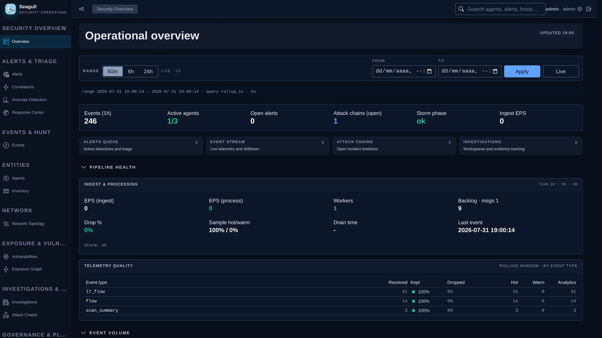
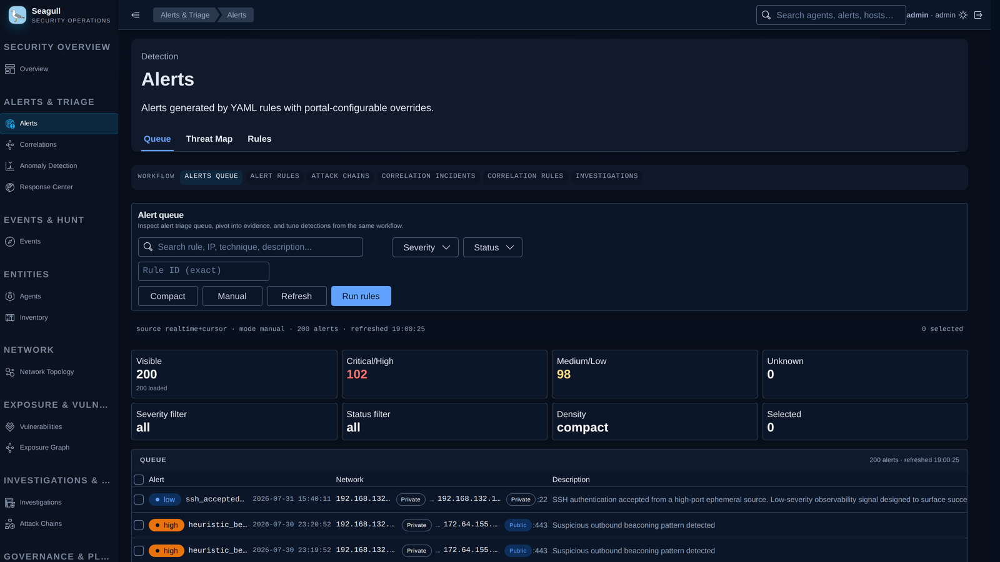
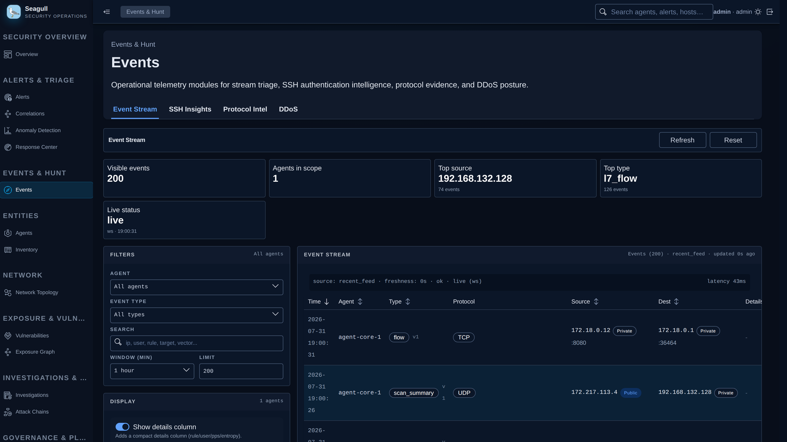
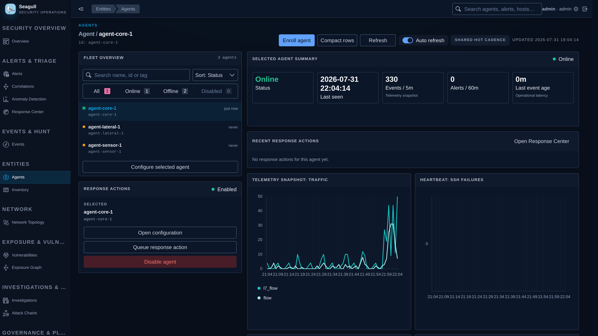
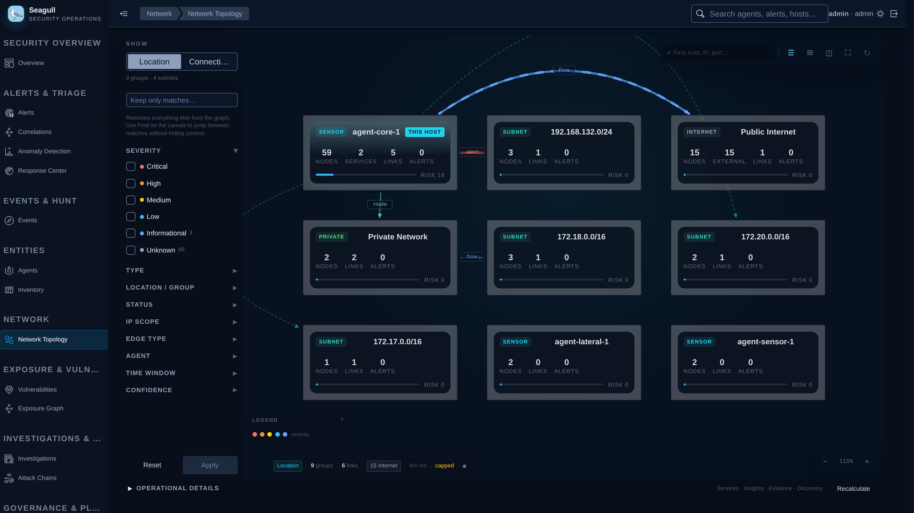
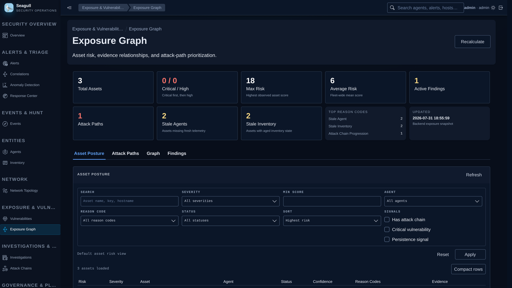

# Seagull

[](LICENSE)
[](backend)
[](frontend)
[](compose.yml)
[](https://github.com/dynasmon/seagull-agent)

Seagull is an open security operations platform. It collects endpoint and network
telemetry, correlates it into alerts and incidents, and gives analysts a focused
portal for triage, hunting, and investigation.

The platform is a FastAPI control plane, a set of detection and enrichment
workers, PostgreSQL/ClickHouse/Elasticsearch storage, and a React portal.
Endpoint collection is performed by [Seagull Agent](https://github.com/dynasmon/seagull-agent),
released independently: the platform runs with no agent installed, and an agent
installs with no access to this repository.

## Seagull capabilities

### Endpoint and network telemetry

Agents collect process execution, network flows, SSH authentication events, and
file integrity changes, plus PCAP-derived port scan, DDoS, and L7 protocol
signals. Host inventory and package data feed vulnerability correlation.

### Detection engineering

Detections are YAML rule packs with a versioned schema, evaluated continuously
by the intelligence workers. Sigma rules can be imported and reviewed. Rules
support backtesting against historical events, and carry health and governance
state so noisy or stale content is visible.

### Correlation and attack chains

Correlation rules group related detections into durable incidents. Attack-chain
stories assemble multi-stage activity into scored timelines, so an analyst sees a
progression rather than isolated alerts.

### Alert triage and investigation

The alert queue supports severity and status filtering, evidence pivoting, and
rule tuning from the same workflow. Investigation workspaces track evidence
across alerts, events, hosts, and findings.

### Network topology and exposure

Observed flows are projected into a topology graph grouped by subnet and
location. The exposure graph scores assets, surfaces attack paths, and explains
each score through reason codes.

### Vulnerability detection

Agent inventory is matched against OSV, scored with CVSS, and correlated with
host exposure so remediation can be prioritized by reachability rather than
severity alone.

### Behavioral analytics

UEBA detectors build per-entity baselines and report explainable anomalies with
the window and contributing signals that produced them.

### Fleet and response management

Agents enroll with single-use tokens and receive a certificate bound to their
identity. Credentials and certificates rotate automatically. Response actions are
dispatched only when the agent has announced the matching capability, and the
endpoint enforces its own local policy regardless of server intent.

### Data pipeline

Ingestion is idempotent per batch and buffered through Redis under load.
PostgreSQL holds operational state, ClickHouse serves analytics rollups, and
Elasticsearch backs event hunting. Worker groups handle ingest, intelligence, and
maintenance independently.

### Security operations

Role-based access control, HttpOnly refresh cookies, hardened headers, rate
limiting, and a hashed audit trail for administrative and login activity.
Secrets can be supplied through `*_FILE` variables for Docker secrets.

## Portal













## Architecture

```text
Seagull Agent (systemd, per host)
        │  HTTPS · mTLS :8444 · enrollment :8445
        ▼
   Caddy edge ──► FastAPI backend ──► PostgreSQL · ClickHouse · Elasticsearch
        │               │
        │               ├── Redis ingest queue and rate limiting
        │               └── ingest · intelligence · maintenance workers
        └──► React portal
```

Services are declared in [`compose.yml`](compose.yml):

| Service | Role |
|---|---|
| `seagull-portal` | React portal served by nginx. |
| `seagull-backend` | API for ingest, auth, agents, detections, triage, topology, exposure, and administration. |
| `seagull-ingest-pipeline` | Queue draining, indexing, rollups, and analytics sink writes. |
| `seagull-intelligence-worker` | Rules, correlations, protocol intelligence, enrichment, attack chains, exposure, topology, and UEBA. |
| `seagull-maintenance-worker` | Audit retention and recurring maintenance. |
| `caddy` | HTTPS edge for the portal, the API, and the agent mTLS listener. |
| `postgres`, `redis`, `clickhouse`, `elasticsearch`, `prometheus` | Data and observability infrastructure. |

## Deployment

Requires Docker with the Compose plugin, Git, curl, jq, and Python 3 with the
`cryptography` package. Node is only needed for frontend development outside
Docker.

```bash
git clone https://github.com/dynasmon/Seagull.git
cd Seagull
./seagull -d --install
./seagull env bootstrap
${EDITOR:-nano} .env
./seagull up
```

`./seagull -d --install` provisions host dependencies (Debian/Ubuntu supported,
Fedora/RHEL best-effort). `./seagull up` bootstraps `.env`, downloads and
validates the GeoLite2 databases, generates the internal PKI, builds the
containers, and waits for the core services. It never compiles or installs an
agent.

Set `MAXMIND_LICENSE_KEY` in `.env` before the first start to enable GeoIP
enrichment.

| Endpoint | Default |
|---|---|
| Portal | `http://localhost:8080` |
| HTTPS edge | `https://localhost:8443` |
| Backend readiness | `http://localhost:8000/health/ready` |
| OpenAPI (dev only) | `http://localhost:8000/docs` |

Log in with `SEAGULL_BOOTSTRAP_ADMIN_USERNAME` and
`SEAGULL_BOOTSTRAP_ADMIN_PASSWORD` from `.env`. Rotate both before exposing the
service.

Common operations:

```bash
./seagull status                     # service health
./seagull logs seagull-backend       # follow one service
./seagull doctor                     # preflight and configuration checks
./seagull db upgrade                 # run migrations
./seagull agent tokens --agent-id id # mint an enrollment token
./seagull ci                         # lint, tests, and image build
```

## Seagull Agent

Agents run as a native `systemd` service on each monitored host and are never
part of the platform deployment. Source, packaging, CI, and the install, upgrade,
rollback, and uninstall lifecycle live in
[`dynasmon/seagull-agent`](https://github.com/dynasmon/seagull-agent).

The platform pins a supported release through `SEAGULL_AGENT_RELEASE_VERSION`, and
`backend/app/features/agents/releases.json` pins the SHA-256 digest of every
artifact the portal is allowed to distribute. A package is served only when its
bytes match that pin, whether it was downloaded from the release source or placed
in `SEAGULL_AGENT_PACKAGE_DIR` by an operator.

### Deploying an agent from the portal

**Agents → Deploy agent** configures the endpoint on the server: identifier,
security profile, architecture, and collectors. The portal then builds an
installer that already carries the platform address, the pinned agent release, a
single-use enrollment token, and — when the edge does not present a publicly
trusted certificate — the trust anchor for it. On the endpoint there is one
command:

```bash
sudo bash seagull-agent-web-01-amd64-installer.sh
```

The installer verifies its embedded package against the pinned digest, refuses a
host of the wrong architecture, resolves the libpcap runtime dependency, installs
the service, enrolls, and only reports success once the endpoint holds a
certificate. Re-running it preserves identity, credentials, queued telemetry, and
local policy; when a different release is already installed it upgrades in place.

When the endpoint can reach the portal directly, the same flow is a single line
that the portal also renders:

```bash
curl --fail --silent --show-error --location \
  --header 'X-Agent-Bootstrap-Token: abt.web-01.…' \
  --output seagull-agent-web-01-amd64-installer.sh \
  https://siem.example.com:8443/api/agents/installer && \
  sudo bash seagull-agent-web-01-amd64-installer.sh
```

That command carries the enrollment token, so it is a secret with the token's
lifetime, and the endpoint must trust the portal's TLS certificate. Endpoints
that cannot reach the portal use the downloaded installer instead.

Air-gapped installs set `SEAGULL_AGENT_PACKAGE_FETCH_ENABLED=false` and place the
release tarballs in `SEAGULL_AGENT_PACKAGE_DIR`; the digest pin is enforced
identically. Operators who prefer to verify the upstream signature themselves
still have the manual path, including the `cosign` invocation, under *Install
from the upstream release instead* in the same drawer.

The endpoint generates its own private key and sends only a certificate signing
request. The `sensor` profile collects telemetry and cannot execute response
actions; `managed` additionally accepts server-dispatched actions permitted by
local policy. See [`secrets/README.md`](secrets/README.md) for the mTLS trust
model.

## Configuration

`./seagull up` creates and syncs `.env`. For production, run `./seagull env
wizard` then `./seagull env prepare` and review the result. Settings that matter
most:

| Variable | Purpose |
|---|---|
| `SEAGULL_JWT_SECRET` | Portal token signing secret. |
| `SEAGULL_BOOTSTRAP_ADMIN_PASSWORD` | Initial administrator password. |
| `SEAGULL_COOKIE_SECURE` | Required when serving over HTTPS. |
| `SEAGULL_ALLOWED_HOSTS` | Accepted hostnames outside local development. |
| `SEAGULL_TRUST_PROXY_HEADERS`, `SEAGULL_TRUSTED_PROXY_CIDRS` | Required behind the edge so agent addresses, audit records and rate limits see the real client instead of the proxy. |
| `SEAGULL_CADDY_DOMAIN`, `SEAGULL_CADDY_EMAIL` | Public TLS and domain configuration. |
| `SEAGULL_AGENT_PUBLIC_HOST` | Hostname advertised to remote agents; defaults to the Caddy domain. |
| `SEAGULL_AGENT_RELEASE_VERSION` | Agent release offered by onboarding. |
| `SEAGULL_AGENT_PACKAGE_DIR` | Where verified agent packages are kept and served from. |
| `SEAGULL_AGENT_PACKAGE_FETCH_ENABLED` | Allows the platform to download a pinned package it does not have. |
| `SEAGULL_AGENT_DEFAULT_SOURCES` | Collectors preselected when an endpoint is deployed. |
| `MAXMIND_LICENSE_KEY` | Enables automatic GeoLite2 downloads. |
| `SEAGULL_CLICKHOUSE_ENABLED` | Analytics sink toggle. |
| `SEAGULL_SEARCH_BACKEND`, `SEAGULL_ES_URL` | Hunting and search backend. |

Every secret above accepts a `*_FILE` variant; prefer those with Docker secrets
in real deployments.

## Development

```bash
./seagull ci                          # full pipeline
./seagull up --mode dev --dev-reload  # fast portal and backend loop
cd backend && python3 -m pytest -q
cd frontend && npm test && npm run build
```

The portal targets Node 20+ and npm 10+; the backend runs Python 3.12.

## Documentation

| Document | Topic |
|---|---|
| [detections/architecture.md](docs/detections/architecture.md) | Detection module boundaries and runtime. |
| [detections/rule_format_v2.md](docs/detections/rule_format_v2.md) | Rule schema and supported blocks. |
| [detections/canonical_fields.md](docs/detections/canonical_fields.md) | Canonical event fields and operators. |
| [detections/correlation_engine.md](docs/detections/correlation_engine.md) | Correlation strategies and durable incidents. |
| [detections/attack_stories.md](docs/detections/attack_stories.md) | Attack-chain templates and scoring. |
| [detections/backtesting.md](docs/detections/backtesting.md) | Detection validation. |
| [detections/sigma_import.md](docs/detections/sigma_import.md) | Sigma import and review. |
| [auth/sessions.md](docs/auth/sessions.md) | Refresh rotation, one-time tokens and reuse detection. |
| [agents/authentication.md](docs/agents/authentication.md) | Agent credential validity and the last-seen throttle. |
| [ingest/admission.md](docs/ingest/admission.md) | Event contract, body ceilings and dead letter operations. |
| [workers/architecture.md](docs/workers/architecture.md) | Worker group manager behavior. |
| [workers/analytical_sinks.md](docs/workers/analytical_sinks.md) | Outbox delivery to ClickHouse and Elasticsearch. |
| [observability/architecture.md](docs/observability/architecture.md) | Metrics and observability APIs. |

Detection content lives in [`rules/`](rules/). The API is documented at `/docs`
when the backend runs in development mode.

## License

Seagull is licensed under the [GNU General Public License v3.0](LICENSE).
